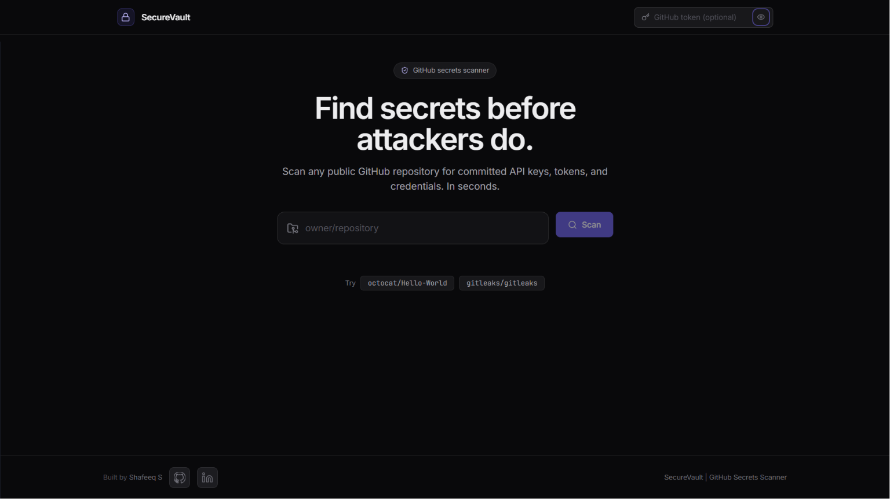
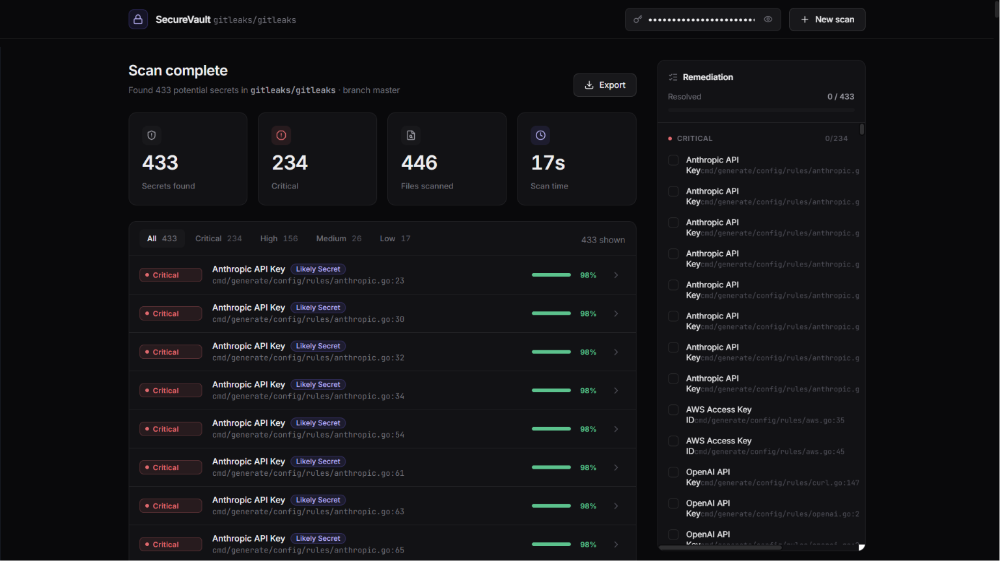

<div align="center">

# 🔐 SecureVault

**Catch leaked secrets before attackers do.**

Ever accidentally pushed an API key to GitHub? SecureVault scans any public repository and surfaces exposed credentials in seconds — with a confidence score so you know what's actually worth worrying about.

[](https://react.dev)
[](https://www.typescriptlang.org)
[](https://vitejs.dev)
[](https://fastapi.tiangolo.com)
[](https://python.org)

[🚀 Try it live](https://securevault-scanner.vercel.app) · [🐛 Report a bug](../../issues) · [💡 Suggest a feature](../../issues)

</div>

---

## Screenshots

**Hero page**



**Results view**



---

## Why SecureVault?

Leaked secrets are one of the most common causes of security breaches — and most of the time, developers don't even realize they've committed one. SecureVault helps you find them fast, understand how serious they are, and know exactly which file to fix.

- Scans entire repositories in a single API call
- Detects 27+ secret types across AI, cloud, payments, and DevOps
- Scores each finding by **severity** (impact if real) and **confidence** (likelihood it is real) — independently
- Redacts secret values before they ever leave the backend
- No sign-up, no install, just paste a repo and go

---

## What it detects

| Secret type | Severity | How it's validated |
|---|---|---|
| **AI / ML** | | |
| OpenAI API Key | 🔴 Critical | `sk-` prefix + `T3BlbkFJ` structural marker |
| Anthropic API Key | 🔴 Critical | `sk-ant-` prefix |
| Hugging Face Token | 🟠 High | `hf_` prefix + length |
| Replicate API Token | 🟠 High | `r8_` prefix + exact length |
| **Cloud** | | |
| AWS Access Key ID | 🔴 Critical | `AKIA`/`ASIA`/`AROA` prefix + length |
| AWS Secret Access Key | 🔴 Critical | Context keyword + length + charset |
| DigitalOcean PAT | 🔴 Critical | `dop_v1_` prefix + 64 hex chars |
| Google API Key | 🟠 High | `AIza` prefix + length |
| **Communication / SaaS** | | |
| SendGrid API Key | 🟠 High | `SG.` prefix + two-segment format |
| Slack Token | 🟠 High | `xox[bpoa]-` prefix |
| Twilio Account SID | 🟠 High | `AC` prefix + 32 hex chars |
| Discord Bot Token | 🟠 High | Context keyword + three-part token format |
| Mailchimp API Key | 🟡 Medium | 32 hex chars + `-us\d` datacenter suffix |
| **DevOps / Registries** | | |
| GitHub Personal Access Token | 🔴 Critical | `ghp_`/`gho_`/`ghu_`/`ghs_` prefix |
| GitHub Fine-Grained PAT | 🔴 Critical | `github_pat_` prefix |
| GitLab Personal Access Token | 🔴 Critical | `glpat-` prefix + exact length |
| npm Access Token | 🔴 Critical | `npm_` prefix + exact length |
| PyPI API Token | 🔴 Critical | `pypi-` prefix + length |
| **Payments / E-commerce** | | |
| Stripe Secret Key (live) | 🔴 Critical | `sk_live_` prefix + length |
| Stripe Publishable Key (live) | 🟡 Medium | `pk_live_` prefix |
| Razorpay Live API Key | 🔴 Critical | `rzp_live_` prefix + exact length |
| Square API Key / OAuth Token | 🟠 High | `sq0atp-`/`sq0csp-`/`EAAAl` prefix |
| Shopify Access Token | 🟠 High | `shppa_`/`shpss_`/`shpca_`/`shpat_` + 32 hex |
| **Infrastructure** | | |
| Private Key (PEM) | 🔴 Critical | `BEGIN ... PRIVATE KEY` header |
| JWT | 🟡 Medium | Base64 header decoded (must contain `"alg"`) |
| Database connection string | 🟠 High | URL with literal password in it |
| Hardcoded API key / password | 🟡 Medium | Keyword + entropy heuristic |

Each finding also carries a **confidence score (1-99%)** built from Shannon entropy, variable name context, file path context (test files and docs get a lower ceiling), and structural format checks. Severity tells you the impact *if it's real*. Confidence tells you how likely it *is* real. Both matter.

---

## Tech stack

| Layer | Technology |
|---|---|
| Frontend | React 18, TypeScript, Vite 8 |
| Styling | CSS custom properties (no framework), Inter + JetBrains Mono |
| Backend | Python 3.12, FastAPI, Pydantic v2 |
| HTTP client | httpx (async) |
| GitHub API | Git Trees API (recursive, 1 request) + Contents API |
| Deployment | Vercel (frontend), Render (backend) |

---

## Running it locally

### What you need

- Node.js 20+ and npm
- Python 3.12+

### 1. Clone the repo

```bash
git clone https://github.com/Shafeeq-Cybersec/SecureVault.git
cd SecureVault
```

### 2. Start the backend

```bash
cd server

# Create a virtual environment
py -3.12 -m venv .venv          # Windows
python3.12 -m venv .venv        # macOS / Linux

# Activate it
.venv\Scripts\activate          # Windows
source .venv/bin/activate       # macOS / Linux

# Install dependencies and run
pip install -r requirements-dev.txt
uvicorn main:app --reload --port 8000
```

API will be at **http://localhost:8000**. Swagger docs at `/docs`.

### 3. Start the frontend

```bash
cd client
cp .env.example .env
npm install
npm run dev
```

Open **http://localhost:5173** and you're good to go.

### 4. GitHub token (optional but recommended)

Without a token, GitHub limits you to 60 API requests per hour. With a free fine-grained token (read-only, Contents permission), that jumps to 5,000. You can generate one at [github.com/settings/personal-access-tokens/new](https://github.com/settings/personal-access-tokens/new) and paste it into the token field in the header.

---

## Project structure

```
SecureVault/
├── client/                   # React + Vite frontend
│   ├── vercel.json
│   ├── .env.example
│   └── src/
│       ├── api.ts            # fetch wrapper + typed errors
│       ├── types.ts          # Finding, ScanResult, Severity
│       ├── components/       # UI components
│       ├── hooks/            # useChecklist, useCountUp
│       └── lib/              # export, storage, validate
│
└── server/                   # FastAPI backend
    ├── Dockerfile
    ├── requirements.txt
    ├── requirements-dev.txt
    ├── .env.example
    ├── main.py
    └── securevault/
        ├── patterns.py       # detection rules
        ├── scoring.py        # multi-signal confidence engine
        ├── scanner.py        # detect, score, redact
        ├── github_client.py  # rate-limit-aware GitHub API client
        └── scan_service.py   # async orchestrator
```

---

## Running tests

```bash
cd server
pip install -r requirements-dev.txt
pytest tests/ -v
```

18 tests covering detection, redaction, confidence scoring, false-positive suppression, and severity/confidence decoupling.

---

## Security

A few things worth knowing about how SecureVault handles data:

- Your GitHub token is only used to set an `Authorization` header on API requests. It is never stored, logged, or sent anywhere else.
- Secret values are always redacted before leaving the backend. The frontend only ever sees a `first6****last4` preview, never the full value.
- SecureVault does not verify credentials against live APIs. It does structural pattern matching only — no calls to AWS, GitHub, Stripe, or anyone else.

---

## License

MIT
